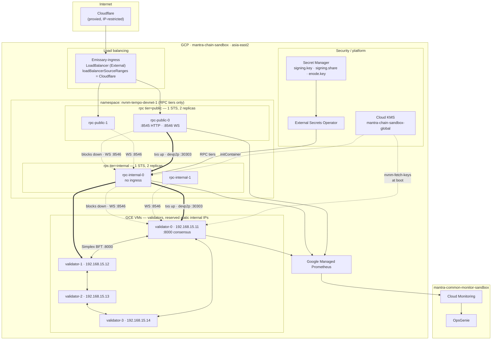
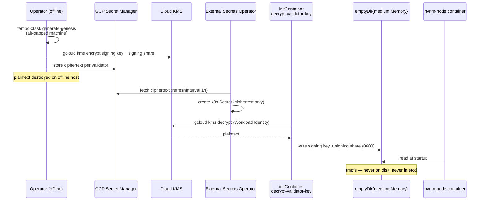
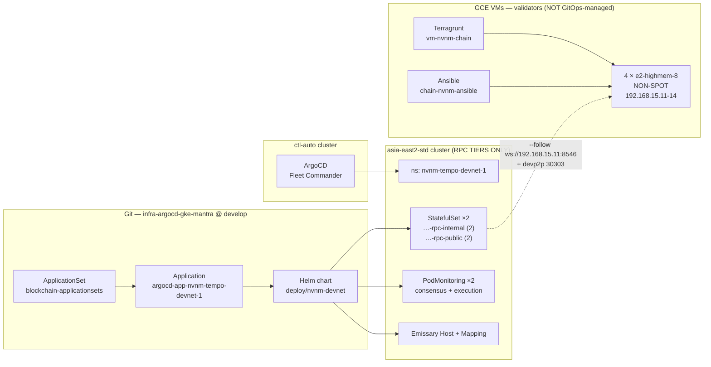
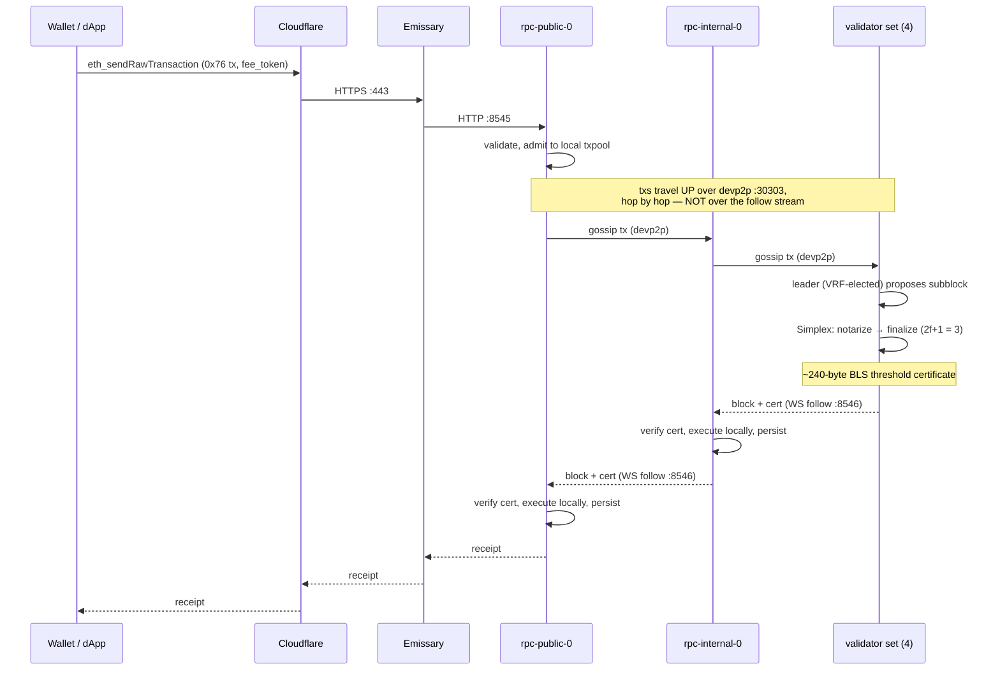

# 02 — Target Architecture

NVNM Chain L1 internal testnet in `mantra-chain-sandbox` (`asia-east2`), split
across two platforms by necessity: **validators on GCE VMs, both RPC tiers on
GKE `mantra-chain-sandbox-asia-east2-std`**. The split is forced by the on-chain
IP binding — see [D-H](./README.md#d-h--where-validators-run-resolved).

---

## 1. Node roles

Tempo is a **single binary, single process** — execution (reth) and
consensus (Commonware Simplex) run together, external Engine API disabled via
`NoopEngineApiBuilder`. There is no EL/CL split, no sequencer, no separate builder.

There is exactly **one** non-validator role: a `tempo node --follow` full node.
"Internal" and "public" are **positions, not node types** — same binary, same
flags, same key types. They differ only in what `--follow` points at, which
peers they gossip transactions with, and whether ingress fronts them.

| Role | `--follow` | Keys | Consensus | Exposed |
|---|---|---|---|---|
| **validator** (GCE VM) | — (runs consensus) | ed25519 + BLS share + enode | Yes — proposes & notarizes | no public IP; IAP SSH only |
| **rpc** tier=`internal` | validator-0 :8546 | ed25519 + enode | No | none — **only tier touching validators** |
| **rpc** tier=`public` | rpc-internal-0 :8546 | ed25519 + enode | No | HTTP 8545 / WS 8546 via Emissary |

A follower "is a **full node**" — it verifies consensus
finalization certificates from upstream, executes every transaction locally,
and stores full state. It is not a trusting proxy.

`crates/consensus/src/follow/mod.rs`: a node "syncs from an
upstream node (**validator or another follower**)". Chaining is first-class,
which is what makes the public tier possible.

> **Certification is on by default — do not disable it.** > `bin/tempo/src/cli.rs` exposes `--follow.nocertify` as the opt-*out*
> (`--follow.experimental.certify` is documented in-source as "a no-op" and is
> hidden). Critically, `has_consensus_engine = !dev && !is_following_uncertified()`
> gates registration of the `consensus` RPC namespace. So an **uncertified
> follower cannot serve a downstream tier at all** — putting `--follow.nocertify`
> on the internal tier silently breaks the public tier's sync source.

### Why the public tier never touches a validator

The public tier is the internet-facing component and therefore the
likeliest to be compromised. With a direct follow it would hold live connections
to `validator:8546` and `validator:30303`. Interposing the internal tier means a
compromised public node can only reach the internal tier. This is an attack-surface
argument, not a load argument — a validator serving `consensus_subscribe` to a
handful of followers is a bounded, low-cardinality workload.

Trust is unaffected by the extra hop: every node independently verifies the
~240-byte BLS threshold certificate against the validator set, so an intermediate
can stall or withhold but cannot forge or serve a fork.

### Not deployed: `p2p-proxy`

`bin/tempo/src/p2p_proxy.rs` builds with `build_with_noop_provider`
and a bare devp2p `NetworkManager` — **no RPC server, no WebSocket listener**, so
it can never be a `--follow` upstream. It also sets `disable_tx_gossip(true)` and
returns empty `GetPooledTransactions`, so it carries no transactions. It serves
`GetBlockHeaders`/`GetBlockBodies` to external reth-compatible peers and nothing
else. Not part of this topology. A dedicated peering tier
(regular full nodes with devp2p exposed, *not* proxies) plus a bootnode endpoint
becomes relevant only once the validator set goes permissionless — roadmap work
gated on NVNMChain decision D-01.

> **Future / mainnet only:** once validators span clusters or clouds, Tempo's
> documented method for hiding a validator's real IP is to register a **GCP L4
> load-balancer IP or DNS name** as the validator's on-chain `ingress`, keep the
> validator in a private subnet, and firewall it to the LB source range.

### Why 4 validators

Simplex "tolerates f Byzantine faults of 3f+1 validators (i.e. < 1/3)",
quorum `2f+1`. With `N=4`: `f=1`, quorum `3`. One validator may be down or faulty
without halting. SPIKE-0001 E1 sets `≥4` as the devnet minimum.

Because validator identities cannot be replicated (GAP-2), `N` is the
*only* availability lever. If a stronger internal SLO is wanted later, go to `N=7`
(`f=2`) rather than adding replicas.

---

## 2. Network topology

Dotted = block ingest (WS `--follow`). Bold = transaction gossip (devp2p).
The public tier has **no edge of either kind** to a validator.

### Traffic matrix

| Source | Destination | Port | Purpose |
|---|---|---|---|
| validator VM | validator VM | 8000/tcp | Consensus P2P, Simplex full mesh (TLS-auth) |
| validator VM | validator VM | 30303/tcp | Execution devp2p — tx gossip |
| rpc/internal (Pod) | validator VM | 8546/tcp | **Blocks down** — WS `--follow` + finality certs |
| rpc/internal (Pod) | validator VM | 30303/tcp | **Txs up** — devp2p gossip to proposers |
| rpc/public | rpc/internal | 8546/tcp | **Blocks down** — WS `--follow` |
| rpc/public | rpc/internal | 30303/tcp | **Txs up** — devp2p gossip |
| Emissary | rpc/public | 8545/tcp | EVM JSON-RPC |
| Emissary | rpc/public | 8546/tcp | EVM WebSocket |
| GMP collector | all | 8001/tcp | Consensus metrics |
| GMP collector | all | 9001/tcp | reth execution metrics |
| Cloudflare | Emissary LB | 443/tcp | Public RPC (IP-restricted) |
| RPC pods (initContainer) | `169.254.169.254` | 80/tcp | GKE metadata — Workload Identity token |
| RPC pods (initContainer) | Google APIs | 443/tcp | `gcloud kms decrypt` at pod start |
| validator VMs | Google APIs | 443/tcp | `nvnm-fetch-keys` unwraps key material at every boot |
| operators | validator VMs | 22/tcp | SSH via IAP (`35.235.240.0/20`), OS Login |

**Explicitly absent:** any row where the source is `rpc/public` and the
destination is `validator`. The `nvnm-…-rpc-public-egress` NetworkPolicy enforces
this rather than relying on configuration alone.

> The last two rows are easy to forget when writing an egress NetworkPolicy, and
> omitting them leaves every pod stuck in `Init:0/1` while presenting as a KMS
> or IAM failure. The chart's public-tier egress policy allows both explicitly,
> with RFC1918 excluded from the 443 rule so it cannot become a backdoor.

Port assignments from NVNMChain `docs/architecture/deploy.md`.
Execution devp2p is reth's default **30303** — note this differs from the
`tempo-devnet` tooling, which derives it as `base_port + 1` (8001). In this
chart 8001 is consensus metrics.

### The two data paths

`--follow` is **block ingest only and carries no transactions.** A transaction
submitted to `rpc/public` lands in that node's local txpool and reaches a
proposer only via execution-layer devp2p gossip, hop by hop up the tier chain.

Wiring only the block path yields a chain where `eth_blockNumber`
rises normally and every health check passes, but no submitted transaction is
ever mined. This is why [04-runbook.md §6](./04-runbook.md#6-verification)
verifies with a real transaction and receipt rather than block height alone.

### Why the RPC tiers, not validators, serve RPC

Tempo node-security guidance: "avoid running other internet-facing
services on the same host as your validator." Putting `--http` on a
validator couples RPC load and RPC-borne DoS to consensus liveness. Validators
run `--ws` only (so the internal tier can follow them) and never `--http`.

> **Known limitation:** every replica in a tier shares one upstream
> (`rpc.tiers.<tier>.upstream.index`). Both internal nodes follow validator-0;
> both public nodes follow rpc-internal-0. That upstream is a single point of
> failure for the tier below it — not for the chain, which keeps producing
> blocks regardless. Mitigation is a repoint or a second release on a different
> upstream: [04-runbook.md §5.5](./04-runbook.md#55-repointing-an-rpc-tier).

---

## 3. Consensus timing budget

Single-region same-zone-region RTT in GCP `asia-east2` is ≤5 ms
between zones. NVNMChain `docs/architecture/deploy.md` gives the tuning table:

| Parameter | Value | Source rule |
|---|---|---|
| `--consensus.target-block-time` | `500ms` | Same-region (≤5 ms RTT) profile |
| `--consensus.wait-for-proposal` | `1200ms` | `≥ target-block-time × 2` |
| `--consensus.wait-for-notarizations` | `1000ms` | `≥ target-block-time × 1.5` |
| `--consensus.network-budget` | `50ms` | Tempo same-region default — see note |
| `--consensus.synchrony-bound` | `5s` | `≥ 2s` to tolerate NTP skew |
| `--consensus.worker-threads` | `3` | Default |
| `--consensus.message-backlog` | `16384` | Default (raise for 10k+ validators) |

"`synchrony-bound` must be ≥ `target-block-time` and at least `2s` to
tolerate NTP skew. Tighten only with hardware PTP clocks."

> **On `network-budget`:** Tempo's stated rule is `2 × P95 RTT`, which at ≤5 ms
> intra-region RTT would be ~10 ms — yet Tempo's own same-region profile
> specifies `50ms`. We keep `50ms` as deliberate headroom for GKE
> pod-network jitter and node CPU contention, both of which inflate effective
> P95 well above the raw inter-zone figure. Tighten only against **measured**
> P95 RTT from the running cluster, not the theoretical number.

> **NTP is a hard dependency.** Tempo requires `chrony` or `ntpd`,
> explicitly **not** `systemd-timesyncd`. Validator VMs are Debian 13 and use
> `chrony` against the GCE metadata NTP server; verify with `chronyc tracking`.
> `synchrony-bound` is `5s`, so more than ~1s of skew already eats most of the
> margin. On GKE COS nodes, time sync is handled by
> the node image against the GCE metadata NTP server — acceptable, but clock skew
> should be alerted on (see [04-runbook.md](./04-runbook.md)).

### If the region decision changes

| Topology | RTT | block-time | wait-for-proposal | Notes |
|---|---|---|---|---|
| Single-region (chosen) | ≤5 ms | 500 ms | 1200 ms | |
| ae2 + nane2 | ~180 ms | 2–4 s | 4–8 s | 8× slower finality |
| 3-region | ~200 ms+ | 4 s | 8 s | Needs new clusters (GAP-5) |

---

## 4. Key custody architecture

Two secrets per validator, both "equivalent to a validator private key":

| File | Type | Scope |
|---|---|---|
| `signing.key` | ed25519, 32-byte hex | P2P identity + consensus messages |
| `signing.share` | BLS12-381 threshold share, CBOR | Block notarization/finalization — **unique per validator, never shared** |

**Security properties from this design:**

- Plaintext key material exists only in tmpfs and only for the process lifetime:
  `emptyDir{medium:Memory}` for RPC-tier pods, `/run/nvnm/secrets` (tmpfs, mode
  0700) on validator VMs, repopulated at every boot by `nvnm-fetch-keys.service`
  and never written to the persistent data disk.
- etcd holds ciphertext only (and etcd itself is KMS-encrypted at rest via the
  existing `gke-encrypt-kms-key`).
- Decrypt capability is bound to a specific KSA via Workload Identity direct
  principal — not a shared GSA key file.
- Compromising Secret Manager alone is insufficient; the attacker also needs the
  KMS decrypt binding.

**Residual risk :** Tempo has no HSM/KMS *signing* path — the node
needs the raw key in process memory. KMS protects at-rest only. A node-level RCE
or a `kubectl exec`/debug-container with sufficient RBAC reads the key. Mitigate
with RBAC on `pods/exec` in the namespace and Wiz runtime detection.

> The Wiz runtime sensor is currently **archived/disabled** in the
> GitOps repo (`infosec-base/_archive/`, `directories: []`). Re-enabling it before
> a validator holds real value is an InfraSec follow-up, tracked as a
> recommendation, not a blocker for a valueless devnet.

---

## 5. Deployment layout

> **Validators are outside the GitOps loop.** This is a real
> downside of the split and should be stated plainly: ArgoCD does not reconcile
> them, so drift on a validator is not self-healing the way an RPC-tier pod is.
> The compensating controls are `serial: 1` Ansible with per-host consensus
> assertions, a pinned binary hash that fails closed, and `deletion_protection`
> on each instance. Someone must still *run* the playbook — nothing notices a
> hand-edited systemd unit until the next converge.

### Why one host per validator (not one StatefulSet with `replicas: 4`)

Each validator has a **distinct** `signing.share` and a distinct
on-chain identity, so the unit of deployment must be the individual validator
whatever the platform. The reasoning survived the move to VMs intact:

| Approach | Pros | Cons |
|---|---|---|
| 1 unit × 4 instances (K8s `replicas: 4`, or Terraform `num_instances = 4`) | Fewer objects | Update touches all 4 → violates GAP-8 lockstep; no per-validator gating; on GCE, one plan for four distinct static IPs |
| **4 units × 1 instance (chosen)** | Independent lifecycle per identity; per-validator upgrade gating and blast radius; each static IP is explicit in its own file | More files (accepted) |

The lockstep-upgrade constraint (GAP-8) is decisive: we must stop, verify, and
start validators one at a time under operator control. On GKE that meant
`OnDelete` on separate StatefulSets; on GCE it means one Terragrunt unit per
validator plus `serial: 1` in Ansible.

---

## 6. Observability

Two metrics endpoints per node, both scraped by GMP `PodMonitoring`:

| Port | Source | Key series |
|---|---|---|
| 8001 | Commonware consensus | `consensus_engine_marshal_finalized_height`, `consensus_engine_executor_finalized_blocks_proposed_by_self_total`, `consensus_engine_epoch_manager_simplex_voter_state_{current_view,timeouts_total}`, `consensus_engine_dkg_manager_ceremony_*`, `consensus_network_listener_handshakes_blocked_total` |
| 9001 | reth execution | reth standard set (block processing, txpool, peers, sync, db) |

> **These names were verified against the binary on and
> differ from NVNMChain's `deploy.md`.** The docs use a `tempo_consensus_*`
> prefix that does not exist; the real prefixes are `consensus_engine_*`,
> `consensus_network_*`, `runtime_*`. Full 219-name reference and the correction
> table: [reference/consensus-metrics-1.12.0.md](./reference/consensus-metrics-1.12.0.md).
> Re-verify on every Tempo version bump.

Logs: structured JSON via `--log.file.directory`, level via `RUST_LOG`.
On GKE we log to stdout and stamp `gke.logging.enabled: "true"` so the existing
sink routes to `mantra-common-monitor-sandbox`.

### Alerting (proposed)

| Alert | Condition | Sev | Rationale |
|---|---|---|---|
| Chain halted | `consensus_engine_marshal_finalized_height` flat 2m | P1 | Primary liveness |
| **Validator excluded** | `rate(consensus_engine_executor_finalized_blocks_proposed_by_self_total[10m]) == 0` on any one validator while the chain advances | **P1** | **The D-H failure mode.** Node looks healthy, syncs blocks, serves RPC — and contributes nothing to consensus. Proven reproducible; nothing else detects it |
| **Handshakes refused** | `rate(consensus_network_listener_handshakes_blocked_total[5m]) > 0` | **P1** | Direct observable for an IP/registration mismatch. Pairs with the alert above to localise which side is rejecting |
| View churn | `rate(consensus_engine_epoch_manager_simplex_voter_state_timeouts_total[5m])` elevated | P2 | remedy: increase `wait-for-proposal` by 2× P95 RTT. A real counter, unlike the gauge-derivative in the earlier draft |
| Validator not signing | `consensus_engine_epoch_manager_how_often_signer_total` flat for one epoch | P2 | Dropped from the active set |
| Participants short | `consensus_engine_epoch_manager_latest_participants < N` | P1 | Quorum at risk |
| DKG ceremony short | `consensus_engine_dkg_manager_ceremony_players < N` at an epoch boundary | P1 | GAP-7 — reshare may fail |
| DKG failing | `rate(consensus_engine_dkg_manager_ceremony_failures_total[1h]) > 0` | P1 | |
| Peers lost | `consensus_network_tracker_directory_connected < N-1` | P2 | |
| Clock skew | `rate(consensus_engine_application_parent_ahead_of_local_time_total[10m]) > 0` | P2 | Parent block ahead of local time → this node's clock is behind, risking `synchrony-bound`. A real in-binary signal, replacing the earlier hand-waved "NTP offset" |
| Finality SLO | `consensus_engine_epoch_manager_simplex_voter_finalization_latency_bucket` p50 > 1s | P3 | SPIKE-0001 E4 gate |
| PVC utilisation | `> 80%` | P3 | See runbook sizing note |

Route P1 to the existing OpsGenie channel
`projects/mantra-common-monitor-sandbox/notificationChannels/12743345179203737827`
used by the `mzone-kubernetes-logs-errors` policy.

> Expressions above are plain PromQL for readability. Under Google Managed
> Prometheus the names are namespaced —
> `prometheus.googleapis.com/consensus_engine_marshal_finalized_height/gauge` —
> so each must be translated when the policies are authored in Terraform
> (`_custom/terraform-gcp-alerts`).

---

## 7. Data flow — a transaction

Note the asymmetry: the tx path is two devp2p hops **up**, the block path is two
WS hops **down**, and they are entirely separate mechanisms. Each block hop
re-verifies the finality certificate independently.

Finality is deterministic and single-shot — no reorgs, no confirmation
depth. Target sub-second p50 (SPIKE-0001 E4 gate); this must be
**measured on our own hardware**, not assumed — NVNMChain X-04 explicitly warns
"don't assume vendor finality/RPS figures".

---

## 8. Multi-perspective review

| Area | Assessment |
|---|---|
| **Security / InfraSec** | New attack surface: tcp:8000 consensus P2P (mitigated — TLS-authenticated, on-chain identity allowlist, `bypass-ip-check false`, ClusterIP only); tcp:30303 devp2p (mitigated — NetworkPolicy restricts validator ingress to validators + internal tier); EVM RPC (mitigated — public tier only, Cloudflare-restricted, `debug`/`trace` enabled on internal but **not** public). Three tiers mean a compromised internet-facing node reaches only the internal tier, enforced by NetworkPolicy egress rather than config alone. Least privilege via per-node KSA → KMS binding. Residual: no HSM signing path; plaintext key in process memory. **Changed by D-H:** the validator↔internal hop now crosses the Pod/VM boundary, so NetworkPolicy no longer governs it — GCE firewall rules do (`allow-nvnm-chain-p2p`, `allow-nvnm-validator-ws-from-gke`, the latter scoped to `10.0.0.0/18` and the `nvnm-validator` tag). Validators gained an SSH surface they did not have as pods, mitigated by OS Login + IAP only, no public IP, and Shielded VM. Validators also sit outside ArgoCD reconciliation. |
| **Performance** | 500 ms blocks need `e2-highmem-8` minimum (8 vCPU meets the "8+ cores" floor but is *below* the "16+ recommended for validators"). Acceptable for a zero-load devnet; revisit to `n2-standard-16`/`c3` for anything load-tested. pd-ssd IOPS scale with size — 200 Gi gives ~6k IOPS, adequate at devnet volume. |
| **Cost** | Moving validators off spot is the single largest delta and is **non-negotiable** for consensus liveness. Mitigation: bin-pack both RPC tiers onto the existing spot `default` class; only the 4 validators need on-demand. The third tier adds ~$230/mo (2 spot nodes + PVCs) over a two-tier design — cheap for the isolation it buys. Full costing in [03-deployment.md §7](./03-deployment.md#7-cost) — **≈ $2,176/mo** all-in at asia-east2 list prices. |
| **Reliability** | Blast radius of one validator loss = `1/4`, chain continues (quorum 3). Loss of 2 = **halt** (recoverable, not fatal — restart restores liveness). Rollback: `OnDelete` + pinned image tag means revert is a tag change + coordinated restart. PVC snapshots via `VolumeSnapshot` give state rollback. |
| **Maintainability** | Helm chart with explicit `args` templating is self-documenting; consensus tuning is visible in `values.yaml` rather than hidden in a ConfigMap. Divergence from the cosmos-operator pattern is a learning cost for the team — mitigated by this doc set. |

---

## 9. Sizing

| Role | Count | CPU req/lim | Mem req/lim | PVC | Class |
|---|---|---|---|---|---|
| validator | 4 | `4` / `8` | `16Gi` / `48Gi` | 200 Gi | `nvnm-validator-class` (on-demand) |
| rpc tier=internal | 2 | `2` / `6` | `8Gi` / `32Gi` | 200 Gi | `default` (spot OK) |
| rpc tier=public | 2 | `2` / `6` | `8Gi` / `32Gi` | 200 Gi | `default` (spot OK) |

Tempo floor: 8+ cores, 32 GiB, NVMe 1 TiB+.
The limits above fit `e2-highmem-8` (8 vCPU / 64 GiB) with one
validator per node. PVC starts at 200 Gi because devnet tx volume is ~zero;
`allowVolumeExpansion: true` on `premium-rwo-xfs` makes growth non-disruptive.
Do **not** size to the 1 TiB mainnet figure for an internal testnet.
