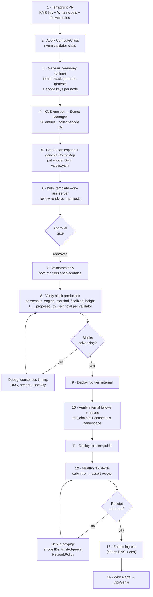

# 03 — GKE Deployment Design

Target: `mantra-chain-sandbox-asia-east2-std`, namespace `nvnm-tempo-devnet-1`.

---

## 1. Object inventory

Verified with helm v3.16.3 and kubeconform v0.6.7
(`-strict`, `-kubernetes-version 1.35.0`): **15 resources, 11 schema-checked,
0 invalid, 4 skipped** (ExternalSecret + PodMonitoring are CRDs).

**This chart no longer deploys validators.** They are GCE VMs (D-H), so the
release dropped from 32 objects to 15. `validator.enabled` defaults to `false`
and the validator templates are retained only as documentation and as an
all-GKE smoke-test path.

| Kind | Count | Notes |
|---|---|---|
| StatefulSet | 2 | rpc-internal (2 replicas) + rpc-public (2 replicas) |
| Service | 4 | ClusterIP & headless per RPC tier |
| ExternalSecret | 2 | one per RPC tier (per-ordinal keys inside) |
| PodDisruptionBudget | 2 | one per RPC tier |
| PodMonitoring | 2 | consensus (:8001) + execution (:9001), all roles |
| NetworkPolicy | 2 | internal-tier ingress + public-tier egress |
| ServiceAccount | 1 | `nvnm-node`, WI direct principal on KMS |
| **Subtotal (chart defaults)** | **15** | `ingress.enabled: false`, `validator.enabled: false` |
| Host / Mapping | 2 / 2 | Emissary — only with `--set ingress.enabled=true` |
| **Total with ingress** | **19** | |

Outside the chart, on GCE:

| Resource | Count | Where |
|---|---|---|
| Reserved static internal IP | 4 | `vm-nvnm-chain/asia-east2/nvnm-tempo-devnet-1/_addresses` |
| Instance template (non-spot) | 1 | `vm-nvnm-chain/_instance-template/validator` |
| Compute instance | 4 | `vm-nvnm-chain/asia-east2/nvnm-tempo-devnet-1/validator-{0..3}` |
| Service account | 1 | `vm-nvnm-chain/_instance-sa/default` |
| Firewall rule | 2 | `allow-nvnm-chain-p2p`, `allow-nvnm-validator-ws-from-gke` |

Tiers are independently gateable: `--set rpc.tiers.public.enabled=false` drops
that tier's StatefulSet, both Services, ExternalSecret and PDB. Setting both RPC
tiers off leaves validators only, which is what step 7 of §5 deploys.

Cluster-scoped, **not** in the chart:
`deploy/nvnm-devnet/platform/computeclass.yaml` → belongs in
`infra-argocd-gke-mantra`.

---

## 2. Why a Helm chart and not cosmos-operator

Every existing chain in this cluster is a `CosmosFullNode` CRD.
That operator drives a CometBFT binary: `26656` P2P, `priv_validator_key.json`,
`config.toml`/`app.toml`, height-keyed `chain.versions` upgrade ladders, Horcrux
threshold signing over a CometBFT-specific gRPC protocol.

NVNM/Tempo shares none of that: single reth+Commonware process,
ports 8000/8001/8545/8546/9001, ed25519 + BLS12-381 threshold share, CLI-only
consensus config, `NoopEngineApiBuilder`.

Extending cosmos-operator to model a Tempo node would mean forking
a second operator and maintaining it — strictly worse than a ~1,100-line Helm chart
for 8 pods. The chart deliberately **reuses the platform primitives** the operator
also uses (`premium-rwo-xfs`, ESO + `ClusterSecretStore/gcp-secrets-manager`, GMP
`PodMonitoring`, Emissary `Host`/`Mapping`, the KMS-decrypt initContainer pattern)
so operational muscle memory carries over.

---

## 3. Key design decisions in the chart

### 3.0 One template for both RPC tiers

`templates/rpc.yaml` ranges over `.Values.rpc.tiers`, so `internal` and `public`
come from the same ~255 lines. That is deliberate: they *are* the same role, and
forking the template would let them drift. Adding a third tier (e.g. an archive
or peering tier) is a values block, not new YAML.

Per-tier knobs: `upstream` (what `--follow` targets), `peerWith` (devp2p
trusted-peers target), `ingress`, `httpApi`, `count`, `resources`, `computeClass`.

### 3.1 One StatefulSet per validator, `replicas: 1`

Covered in [02-architecture.md §5](./02-architecture.md#5-deployment-layout).
Short version: the BLS share is per-validator and non-shareable, and lockstep
upgrades need per-validator start/stop control.

### 3.1a Per-ordinal devp2p keys for RPC tiers

Each replica in a tier needs a **distinct** secp256k1 enode identity, and the
identity must be **stable** across restarts because the tier below pins it in
`--trusted-peers`. Ephemeral keys would silently break the transaction path on
every pod restart.

The `ExternalSecret` for a tier carries all ordinals' ciphertext
(`enode.key-0.enc`, `enode.key-1.enc`, …). The decrypt initContainer derives its
ordinal from the pod hostname suffix and decrypts only its own:

```bash
ORDINAL="${HOSTNAME##*-}"          # nvnm-…-rpc-internal-1  ->  1
src="enode.key-${ORDINAL}.enc"
```

Same mechanism as `cosmos-operator`'s `/etc/podinfo/ordinal` pattern, without
needing the downward API.

### 3.2 `updateStrategy: OnDelete` on validators

"all custom chain participants must run the same build"; precompile
and consensus changes activate at a fork height across the whole fleet.

`RollingUpdate` would let Helm/ArgoCD restart validators
automatically and asynchronously, producing a transient mixed-version set. With
`OnDelete`, applying a new image tag changes the StatefulSet spec but touches
**nothing** until an operator deletes each pod deliberately, in the order the
runbook specifies.

Both RPC tiers keep `RollingUpdate` — they hold no consensus role.

### 3.3 Fail-fast template guards

```
$ helm template nvnm .
Error: chain.evmChainId is unset (DECISION D-A). 262144 and 7888 are already
taken in mantra-chain-sandbox. Set an unused EVM chain ID before deploying.

$ helm template nvnm . --set chain.evmChainId=999999
Error: image.tag is unset (DECISION D-C). Pin an immutable tag or digest —
never `latest`. A mixed-version validator set can fork the chain.
```

A `latest` tag on a consensus binary is a chain-fork hazard, not a
style issue: two validators pulling `latest` at different times run different
code. The guard makes that unrepresentable.

### 3.4 PDB `minAvailable: 1` on a 1-replica StatefulSet

This blocks **all** voluntary eviction of that validator — node
drains, autoscaler consolidation, and GKE maintenance will all refuse. That is
the intent (GAP-7: DKG resharing needs every validator online at the epoch
boundary). Operators bypass it deliberately per the runbook, which is the correct
friction for this workload.

### 3.5 NetworkPolicy

Validators accept:

- tcp/8000 from validator pods only (consensus mesh)
- tcp/8546 from `rpc` tier=`internal` pods only (WS follow)
- tcp/30303 from validators and `rpc` tier=`internal` only (devp2p tx path)
- tcp/8001, tcp/9001 from `gmp-system` (metrics)

Everything else is denied. The cluster runs Dataplane V2
(`datapath_provider = ADVANCED_DATAPATH`), so NetworkPolicy is enforced natively.

> Terragrunt sets `network_policy = false` on this cluster. With
> Dataplane V2 that flag disables the legacy Calico add-on, not NetworkPolicy
> enforcement — Dataplane V2 enforces `networking.k8s.io/v1` NetworkPolicy
> regardless. **Verify this empirically** before relying on it (see
> [04-runbook.md §6](./04-runbook.md#6-verification)).

### 3.6 Security contexts

Pod: `runAsNonRoot: true`, `runAsUser/Group: 1000`, `fsGroup: 1000`,
`seccompProfile: RuntimeDefault`.
Containers: `allowPrivilegeEscalation: false`, `readOnlyRootFilesystem: true`,
`capabilities.drop: [ALL]`.

The `google/cloud-sdk:slim` initContainer runs under the same constraints, with
`CLOUDSDK_CONFIG=/tmp/gcloud` on a writable scratch volume so gcloud works under
a read-only root filesystem.

---

## 4. Prerequisites (in order)

| # | Item | Owner | Where |
|---|---|---|---|
| 1 | **EVM chain ID** decided (D-A) | Chain team | `values.yaml` |
| 2 | **Network name** confirmed (D-B) | Chain team | `values.yaml` |
| 3 | **Forked node image** published (D-C) | Chain team | `ghcr.io/nvnm-chain/...` |
| 4 | KMS key `nvnm-tempo-devnet-1-validator-key` + WI principals | InfraSec | [terragrunt-stubs.md](../../deploy/nvnm-devnet/platform/terragrunt-stubs.md#1-kms-key-for-validator-key-envelope-encryption) |
| 5 | ComputeClass `nvnm-validator-class` | InfraSec | [computeclass.yaml](../../deploy/nvnm-devnet/platform/computeclass.yaml) |
| 6 | Genesis ceremony → `genesis.json` + enode keys + 20 Secret Manager entries | Chain team + InfraSec | [04-runbook.md §2](./04-runbook.md#2-genesis-ceremony) |
| 7 | Namespace + `ghcr-io-secret` ExternalSecret | InfraSec | GitOps |
| 8 | *(ingress only)* DNS zone + wildcard cert + reflector allow-list | InfraSec | [terragrunt-stubs.md](../../deploy/nvnm-devnet/platform/terragrunt-stubs.md) §4 |

Items 1–3 are chain-team blockers. Items 4–5 are InfraSec work that
can start today in parallel. Item 6 needs both.

---

## 5. Deployment order



**Tiers come up bottom-up** — an RPC node cannot start without a
reachable upstream WS endpoint, so validators must be producing before the
internal tier starts, and the internal tier must be serving before the public
tier starts.

**Step 12 is the one people skip.** Block height rising proves only the WS path.
The devp2p transaction path is separate and can be silently broken by a wrong
enode ID, a missing `--trusted-peers`, or an over-tight NetworkPolicy — with
every health check still green. Do not call the deploy done before a receipt.

---

## 6. GitOps integration

The platform uses ApplicationSets with a
`matrix{clusters, git.directories}` generator plus a `kustomize-env-plugin` CMP.
Chain apps live at `sandbox/clusters/blockchain/<clusterName>/` and are a second
app-of-apps hop.

Proposed ArgoCD Application, to be added at
`sandbox/clusters/blockchain/mantra-chain-sandbox-asia-east2-std/argocd-app-nvnm-tempo-devnet-1.yaml`:

```yaml
apiVersion: argoproj.io/v1alpha1
kind: Application
metadata:
  name: nvnm-tempo-devnet-1
  namespace: argocd
spec:
  project: mantra-chain-blockchain
  destination:
    server: ${ARGOCD_ENV_CLUSTER_URL}
    namespace: nvnm-tempo-devnet-1
  source:
    repoURL: https://github.com/MANTRA-Finance/infra-argocd-gke-mantra.git
    targetRevision: develop
    path: sandbox/clusters/blockchain/mantra-chain-sandbox-asia-east2-std/nvnm-tempo-devnet-1
    helm:
      valueFiles: [values.yaml]
  syncPolicy:
    # automated: DELIBERATELY OMITTED.
    # Matches the existing convention for chain nodes in this repo, and is
    # required here: auto-sync could restart a validator during a DKG epoch
    # boundary or push a mixed-version validator set.
    syncOptions:
      - Validate=false
      - CreateNamespace=true
      - PrunePropagationPolicy=foreground
      - PruneLast=true
      - RespectIgnoreDifferences=true
      - ApplyOutOfSyncOnly=true
    retry:
      limit: 5
      backoff: {duration: 5s, factor: 2, maxDuration: 3m}
  revisionHistoryLimit: 10
```

> `mantra-chain-blockchain` AppProject currently allows
> `sourceRepos: [infra-argocd-gke-mantra.git, chain-relayer]`. No change needed
> if the chart is vendored into the GitOps repo. If the chart stays in `tempo-py`,
> add that repo to `sourceRepos`.

Two options for where the chart lives:

| Option | Pros | Cons |
|---|---|---|
| Vendor chart into `infra-argocd-gke-mantra` | Matches existing convention; no AppProject change; single repo to review | Chart drifts from `tempo-py` source of truth |
| Keep in `tempo-py`, add to `sourceRepos` | Single source of truth; chart lives with the SDK/devnet tooling | AppProject change; two repos in a deploy review |

**Recommendation:** vendor it. The GitOps repo is already the audited
surface for anything that reaches a cluster, and splitting that surface for one
chart is not worth the review complexity.

---

## 7. Cost

`asia-east2` (Hong Kong) **list** prices, 730 h/month. Validate against actual
billing — sandbox may have committed-use or sustained-use discounts applied.

| Item | Qty | Unit rate | Unit/mo | Monthly |
|---|---|---|---|---|
| `e2-highmem-8` on-demand (validators) | 4 | $0.5059/hr | $369.33 | **$1,477** |
| `e2-highmem-8` spot (both RPC tiers, on the existing `default` class) | 4 | $0.1048/hr | $76.50 | **$306** |
| `pd-ssd` 200 Gi | 8 | $0.187/GB/mo | $37.40 | **$299** |
| `pd-balanced` 100 GB boot (validator nodes) | 4 | $0.11/GB/mo | $11.00 | **$44** |
| Cloud Logging / Monitoring ingest | — | — | — | ~$50 |
| **Total** | | | | **≈ $2,176/mo** |

> **Cost figure is STALE — recalculate before quoting it.** It was
> computed with validators as GKE pods on the spot pool. They are now four
> non-spot `e2-highmem-8` VMs with 200GB pd-ssd each, which is the dominant line
> item and roughly 3-4x the spot equivalent. The RPC-tier numbers still hold.
> Recompute with:
> ```bash
> gcloud compute machine-types describe e2-highmem-8 \
>   --zone asia-east2-a --project mantra-chain-sandbox \
>   --format='value(guestCpus,memoryMb)'
> ```
> and the current on-demand `asia-east2` rate — do not reuse the spot price.

The third tier costs **~$230/mo** over a two-tier design (2 spot nodes + 2 PVCs).
That is a small price for removing every network path between an
internet-facing node and a validator; if cost pressure is severe, drop
`rpc.tiers.public.count` to 1 before considering collapsing the tier.

Sources: [gcloud-compute.com/asia-east2](https://gcloud-compute.com/asia-east2.html),
[e2-highmem-8](https://gcloud-compute.com/e2-highmem-8.html).

### The spot question

Running the 4 validators on-demand costs **~$1,170/mo more** than all-spot
(4 × $369.33 = $1,477 vs 4 × $76.50 = $306). That is the price of
consensus liveness and it is not optional — GAP-3 explains why: correlated
preemption of 2 of 4 validators drops below the `2f+1 = 3` quorum and halts the
chain.

Legitimate levers if cost pressure is real:

| Lever | Saving | Trade-off |
|---|---|---|
| `e2-highmem-8` → `e2-standard-8` (32 GiB) | ~$96/validator/mo → **~$382/mo** | Still meets Tempo's 32 GiB floor, but zero headroom. Fine for an idle devnet; re-evaluate before load testing. |
| 1-year CUD on the 4 validator nodes | ~$137/validator/mo → **~$547/mo** | Locks in a year. Reasonable if the testnet is long-lived. |
| Reduce validator count | — | **Not available.** N=4 is already the minimum for `f=1`. |
| Validators on spot | ~$1,170/mo | **Do not.** Trades a recurring chain-halt risk for cost. |

---

## 8. Rollback

| Scenario | Action | RTO |
|---|---|---|
| Bad image tag (RPC tiers) | Revert `image.tag`, `helm upgrade` | ~5 min |
| Bad binary (validators) | Revert `binary_tag` + `tempo_sha256`, `ansible-playbook playbooks/upgrade-binary.yml` (`serial: 1`) | ~20 min |
| Bad consensus tuning | Revert `values.yaml`, same restart procedure | ~10 min |
| Corrupt execution state (1 node) | Delete PVC, restart — node backfills from peers | hours (backfill is 8 blocks/s) |
| Corrupt consensus state (1 node) | `rm -rf /data/consensus` — node re-derives from last finalized block | ~15 min |
| Chain halt (< quorum) | Restore validators to ≥ `2f+1`; chain resumes | ~15 min |
| Total loss | Re-run genesis ceremony — devnet has no value to preserve | ~1 day |

"A validator that loses state can recover by replaying blocks from
genesis from a peer"; "Never delete the data directory and re-sync
with the same signing key — this risks double-signing." Deleting only the
`consensus` subdirectory is explicitly safe.
